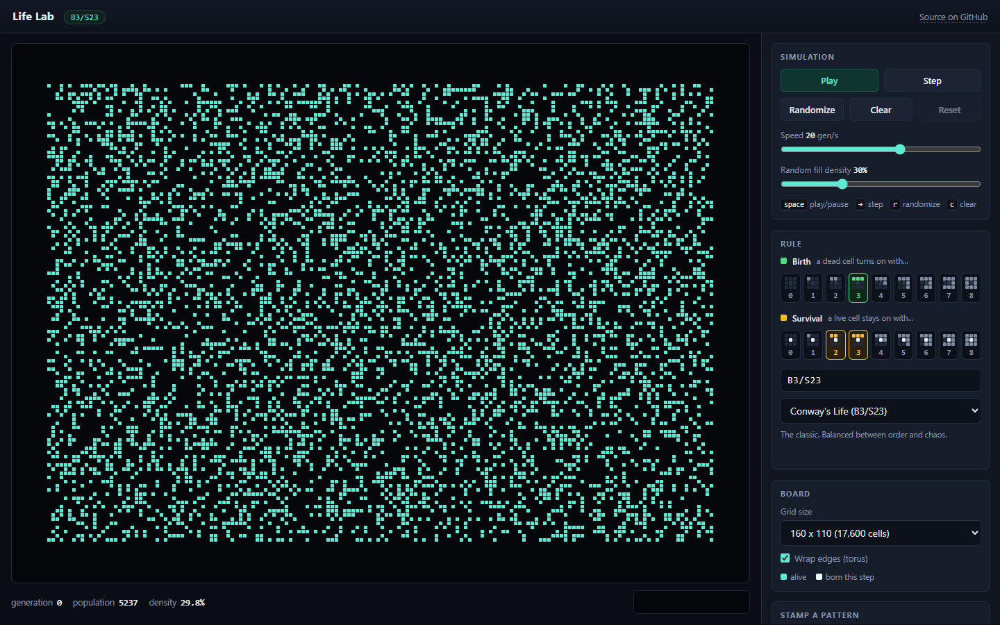
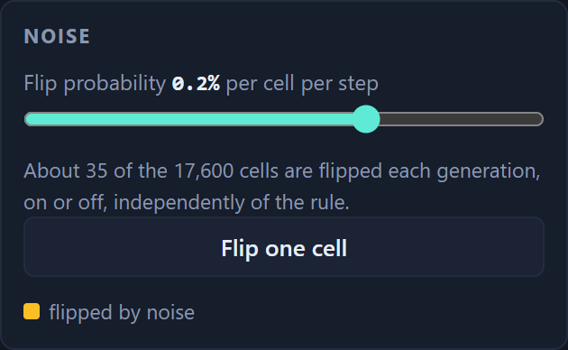

# Life Lab

An interactive laboratory for binary outer-totalistic cellular automata, built for the Emergent Complexity initial assignment.

**Live site:** https://wind3264.github.io/emergent-complexity/



## What it does

- **Draw** cells by dragging on the board; shift-drag or right-drag erases.
- **Run, pause, and step** one generation at a time.
- **Adjust speed** from 1 to 120 generations per second.
- **Seed random soups** at any density from 1% to 99%.
- **Reset** the board to the configuration it had at generation 0, so a run can be repeated after changing the rule.
- **Edit the rule** with two rows of nine toggles, one per neighbor count.
  Each toggle draws a small Moore neighborhood showing exactly the situation it controls.
- **Stamp known patterns** (glider, Gosper glider gun, R-pentomino, HighLife replicator, and others) onto the board.
- **Add noise**: flip each cell with a chosen probability at every step, from one cell in 100,000 up to one in 20, or flip a single cell by hand.
  Cells the noise flipped are painted amber so a perturbation can be told apart from a birth the rule produced.
- **Watch the statistics**: generation, population, density, a population sparkline, and an automatic verdict when the board goes extinct, freezes into a still life, or falls into a cycle.

## The rule editor

An outer-totalistic rule decides a cell's next state from its own state and the number of live cells among its eight neighbors.
It is written `B<birth counts>/S<survival counts>`, so Conway's Life is `B3/S23` and HighLife is `B36/S23`.
There are 2^18 = 262,144 such rules.

The editor exposes exactly those 18 bits.
The **Birth** row shows nine dead centers, the **Survival** row shows nine live centers, and each icon lights up the number of neighbors it stands for.
Toggling any icon rewrites the rule string immediately; typing a rule string (or picking one of thirteen presets) moves the toggles.

## Noise

Every cell is flipped independently with probability `p` after each generation, on or off, regardless of the rule.
The slider runs from off to one cell in twenty, and the panel reports how many cells that works out to on the current board, because `p = 0.001` means nothing until you know it is 18 cells on a 160x110 board.



Cells the noise flipped are painted amber, so a perturbation can be told apart from a birth the rule produced.
**Flip one cell** injects a single perturbation, which is the experiment behind the damage-spreading measurement: on settled Conway ash, 52 of 60 single flips heal completely and the other 8 restart a whole region.

## How it works

`src/lib/life.ts` holds the engine and has no dependency on React.

- A rule is two 9-bit masks, so a lookup is `mask & (1 << neighborCount)`.
- A board is a flat `Uint8Array`, and each step writes into a second buffer that is then swapped in, which avoids allocating per generation.
- The neighbor sum is computed with precomputed row offsets and resolves wrapping once per row and column rather than once per neighbor.
- Edges are either toroidal or dead, controlled by the **Wrap edges** checkbox.

`src/components/LifeLab.tsx` owns the interface.
The simulation runs in a `requestAnimationFrame` loop that reads refs and paints the canvas directly, so a board running at 120 generations per second does not re-render React; only the statistics footer is updated, at roughly 10 Hz.
Cells born in the current generation are painted brighter than surviving cells, which makes gliders and growth fronts visible at a glance.

Extinction, still lifes, and short cycles are detected by hashing each generation and comparing against the last 32 hashes.
The cycle detector is switched off while noise is on, because a repeated board only means a cycle when the rule is the only thing changing the board.

Noise flips each cell independently with probability `p` per generation.
Rather than draw a random number per cell, `applyNoise` draws the gap to the next flipped cell straight from the geometric distribution, so the cost is proportional to the number of flips rather than to the size of the board.

## Running it locally

```bash
npm install
npm run dev      # http://localhost:3000
npm test         # engine and pattern tests
npm run build    # static export into out/
```

## Tests

`npm test` runs 31 tests covering the engine and the pattern catalogue.

- Rule parsing and formatting round-trips, including the `3/23` and `S23/B3` spellings and rejection of malformed rules.
- Conway's rule reproduces the block, the blinker, the glider's diagonal displacement, and the death of a lone cell.
- Bounded and toroidal edges, including a glider that crosses an 8x8 torus and returns to its starting cells after 32 generations.
- Noise: nothing flips at rate 0, everything flips at rate 1, and at rate `p` the number of flips is close to `p * N`, each index reported once and in ascending order.
- Every catalogued pattern is verified against the behavior its description claims: the pulsar has period 3, the Gosper gun adds exactly 5 cells every 30 generations, Diehard vanishes at generation 130, and the HighLife replicator becomes two structurally identical translated copies of itself at generation 12.

That last test caught two genuinely wrong patterns during development, described in [docs/observations.md](docs/observations.md).

## Findings

The full write-up of all five tasks is [report/report.pdf](report/report.pdf).

| | what it covers | regenerated by |
| --- | --- | --- |
| [docs/observations.md](docs/observations.md) | Tasks 1 and 2: Conway across initial densities, the census of leftover structures, HighLife | `scripts/survey.mjs` |
| [docs/rule-survey-output.md](docs/rule-survey-output.md) | Task 3: 100 sampled rules classified, plus a search for Life-like rules | `scripts/rule-survey.mjs` |
| [docs/noise-output.md](docs/noise-output.md) | Task 4: steady state against noise rate, structure lifetimes, damage spreading | `scripts/noise-survey.mjs` |

Every script imports the same engine the website runs and uses a seeded random generator, so re-running one reproduces its tables exactly.

## Layout

```
src/lib/life.ts          engine: rules, grids, stepping, noise
src/lib/patterns.ts      pattern catalogue and rule presets
src/components/          LifeLab (canvas, loop, controls) and RuleEditor
scripts/lib/             helpers shared by the experiment scripts, and a PNG writer
scripts/survey.mjs       Tasks 1 and 2
scripts/rule-survey.mjs  Task 3: sampling and searching the rule space
scripts/noise-survey.mjs Task 4: noise and perturbations
scripts/screenshots.mjs  the site screenshots used in the report
report/report.tex        the report
.github/workflows/       test, build, and publish to GitHub Pages
```
