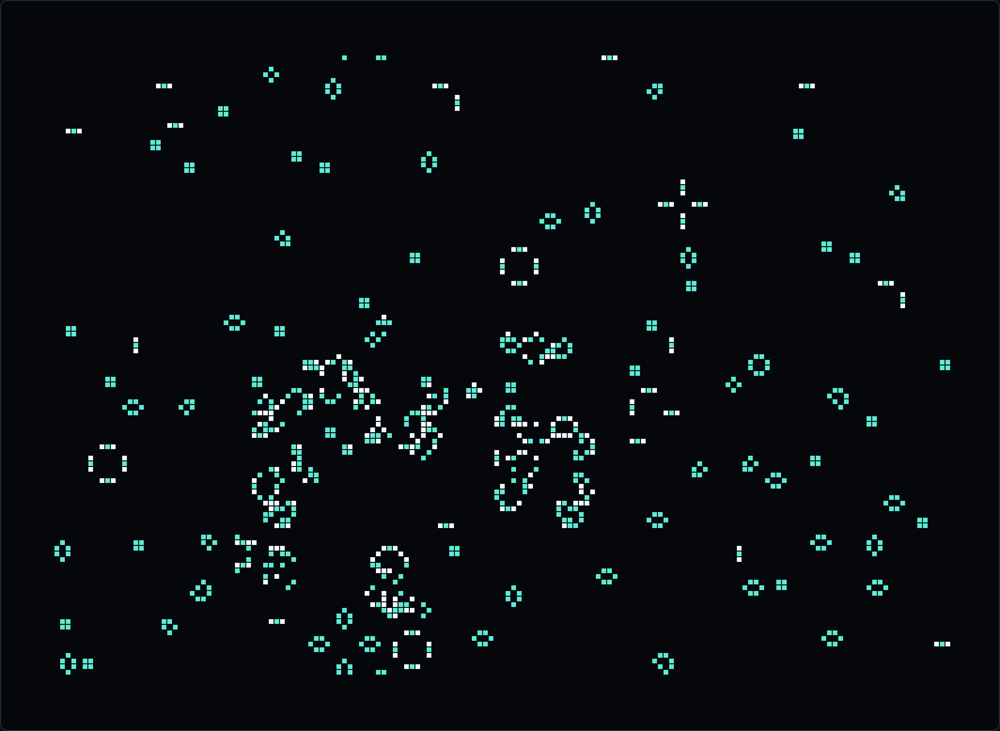
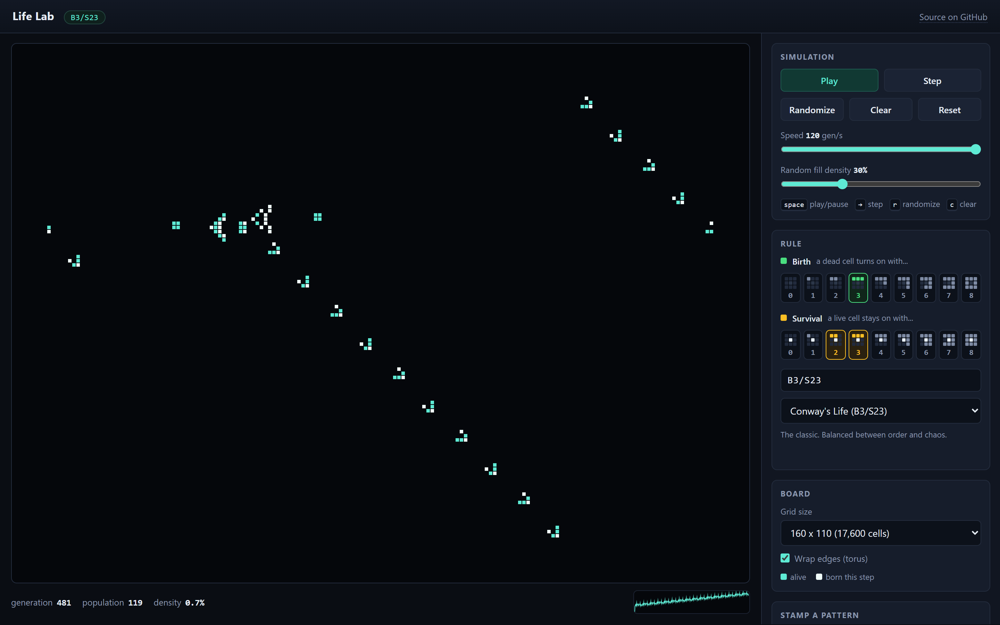
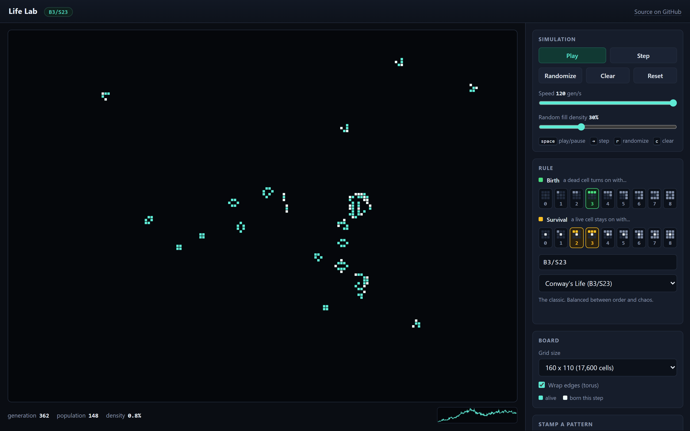
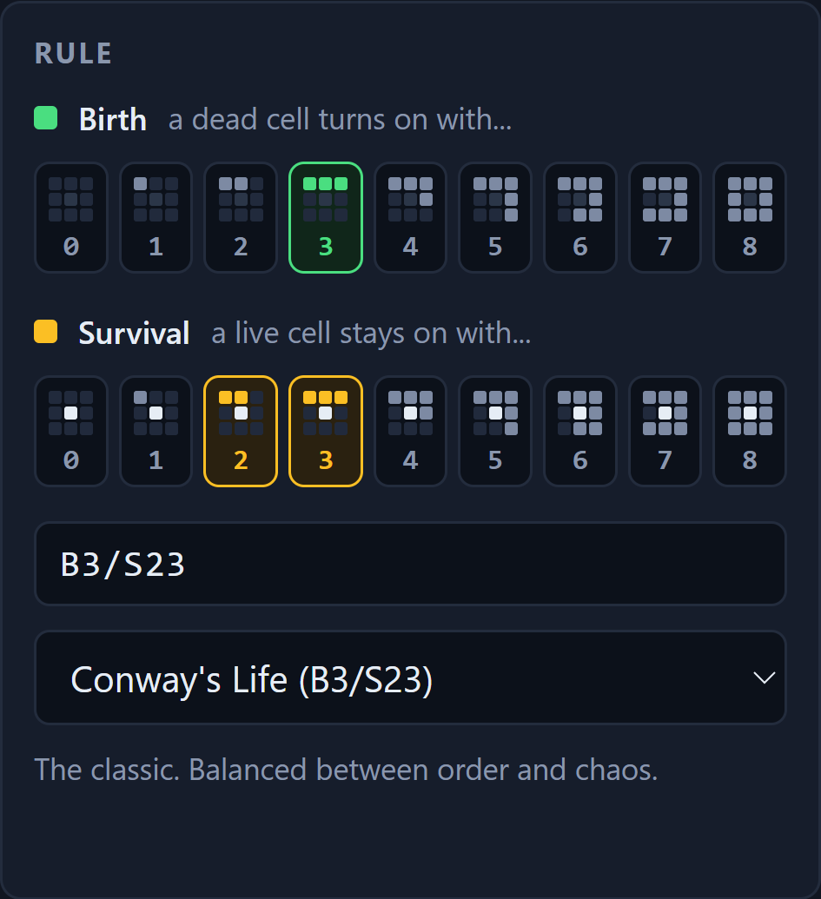
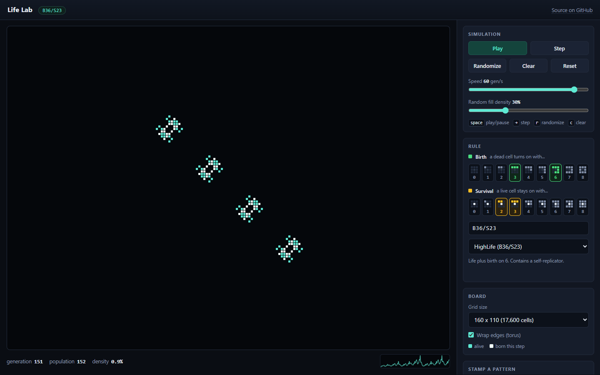
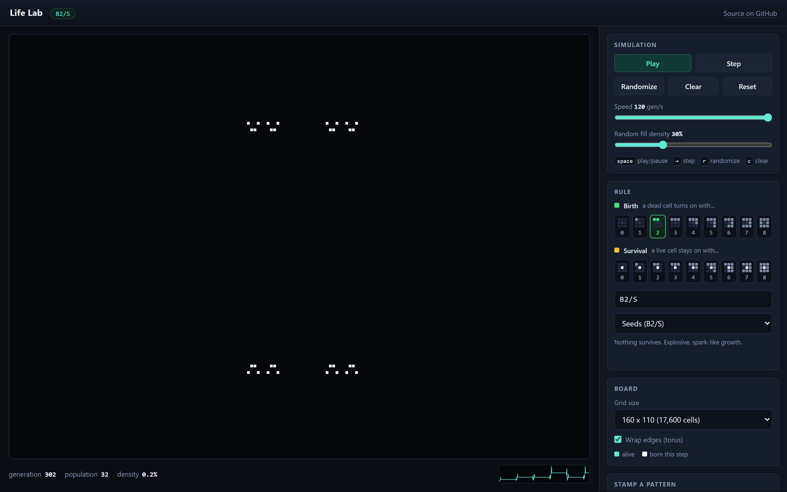

# Observations

What the simulator was used to measure, for Task 1 (explore Conway's Life from random configurations) and Task 2 (make the rule editable and explore HighLife).

Every number here comes from `scripts/survey.mjs`, which imports the same engine the website runs and uses a seeded random generator, so `node scripts/survey.mjs` reproduces the tables exactly.
The raw output is in [survey-output.md](survey-output.md).

**Method.**
Each trial fills a 96x96 torus at a chosen density, then runs until the board exactly repeats a state it has already been in, which means it has entered a cycle, or until 3000 generations pass.
Repeats are found by hashing every generation and keeping all hashes in a map, so a cycle of any length up to the cap is detected, and the generation it starts at is known exactly.

## 1. Initial density barely matters, and that is the surprise

Twelve soups at each of fourteen densities from 5% to 80%, under Conway's `B3/S23`:

| initial density | reached a cycle | never settled | median generation the cycle starts | mean final density |
| --- | --- | --- | --- | --- |
| 5% | 11 | 1 | 19 | 0.86% |
| 10% | 12 | 0 | 1211 | 2.63% |
| 20% | 10 | 2 | 1655 | 3.03% |
| 30% | 12 | 0 | 1811 | 3.07% |
| 40% | 12 | 0 | 1260 | 2.95% |
| 50% | 10 | 2 | 1764 | 2.77% |
| 60% | 8 | 4 | 1773 | 2.64% |
| 70% | 12 | 0 | 1304 | 2.56% |
| 80% | 11 | 0 | 10 | 0.44% |

The striking result is the last column.
A board that starts 10% full and a board that starts 70% full both end up at roughly **2.6% to 3.1% live cells**.
Over that whole range the final density varies by less than half a percentage point while the initial density varies by a factor of seven.
Life has an attractor, and the initial density mostly does not choose where the system lands, only how long it takes to get there.

The two ends of the range behave differently, and for opposite reasons.
At 5% the soup is too sparse: most cells have fewer than two neighbors and die immediately, so the board collapses to a handful of survivors within about 19 generations.
At 80% the soup is too crowded: nearly every cell has more than three neighbors and dies of overpopulation in the first generation or two, and the board is essentially dead by generation 10.
The very first generation at high density is the most violent event in any of these runs, and the population drops by an order of magnitude in one step.

In between, from 10% to 70%, the boards take a long time to settle, typically 1200 to 1800 generations, and the settling time does not vary in any clean way with the starting density.
The 12 runs at 60% include 4 that were still evolving at generation 3000.

Watching this happen is the clearest demonstration of self-organization in the project.
A board goes from uniform noise to a sparse, structured field of small stable objects, and the transition is not imposed by anything in the rule, which only ever mentions counts from 0 to 8.

## 2. What is left over: an ash of a few recurring shapes

Once a board settles, it is not empty and it is not random.
It is a sparse scattering of a small number of repeating structures, which the Life community calls the "ash".



Taking every isolated structure on 13 settled Conway boards, 590 in total:

| structure | kind | share | shape |
| --- | --- | --- | --- |
| block | still life | 41.5% | `##` / `##` |
| beehive | still life | 23.2% | `.#.` / `#.#` / `#.#` / `.#.` |
| blinker | oscillator, period 2 | 17.6% | `###` |
| boat | still life | 6.9% | `##.` / `#.#` / `.#.` |
| loaf | still life | 6.4% | `.##.` / `#..#` / `#.#.` / `.#..` |
| pond | still life | 1.2% | `.##.` / `#..#` / `#..#` / `.##.` |
| ship | still life | 1.0% | `##.` / `#.#` / `.##` |
| tub | still life | 0.7% | `.#.` / `#.#` / `.#.` |
| long boat | still life | 0.5% | `##..` / `#.#.` / `.#.#` / `..#.` |
| toad | oscillator, period 2 | 0.3% | `.###` / `###.` |

Structures are grouped so that anything within two cells of anything else is treated as one object and simulated together, because two shapes closer than three cells apart can affect each other.
Only groups containing a single touching structure are counted individually, and each is then classified by simulating it alone until it repeats.
The names come from matching the shape against a table of known Life objects, up to rotation and reflection; anything unmatched would be reported as "unnamed" and nothing in the top of the census was.

Three observations from this.

**The distribution is extremely lopsided.**
Five shapes account for 95% of everything on the board.
Roughly two of every five surviving objects is the 2x2 block, the simplest thing that can persist at all.

**Almost everything is frozen.**
About 82% of the leftovers are still lifes that never change.
Only 18% oscillate, and essentially all of those are the period-2 blinker.
The complexity that made the board interesting at generation 50 is almost entirely gone by generation 1500, and what remains is the small subset of shapes stable enough to survive it.

**The boundaries are self-created.**
Nothing in the rule mentions regions or edges, but a settled board is clearly divided into empty space and small occupied islands.
The structures are the boundaries: a block persists precisely because it presents exactly the right neighbor counts on all sides to neither die nor grow.

## 3. Moving objects are real but rare

Task 1 asks about moving objects, so gliders were counted directly rather than inferred.
Each board was run 1500 generations and then scanned for clusters whose shape matches a glider up to rotation and reflection:

| initial density | Conway soups containing a glider | HighLife soups containing a glider |
| --- | --- | --- |
| 10% | 1 of 10 | 0 of 10 |
| 20% | 2 of 10 | 1 of 10 |
| 30% | 0 of 10 | 0 of 10 |
| 45% | 1 of 10 | 0 of 10 |
| 60% | 0 of 10 | 1 of 10 |

So a random Conway soup leaves a surviving glider roughly 8% of the time on this board size.
They are much rarer than any of the static shapes, but they matter out of proportion to their frequency: a glider is the only common object that transports information across the board, and it is the reason a board can keep changing long after everything else has frozen.

This also explains an artifact in the first table.
The "longest period" column reads 384 at 5% and 80% density, and 384 is exactly `4 x 96`, the number of generations a glider needs to cross a 96-cell torus and return to where it started.
A board containing one glider and otherwise nothing but still lifes is technically periodic, but with a period hundreds of times longer than the period-2 boards.
A single moving object changes the recurrence time of the entire system by two orders of magnitude.

A glider gun makes the same point more dramatically, and unlike a random soup its growth never stops:



The population trace at the bottom right climbs in a straight line rather than levelling off, because 36 cells arranged correctly produce five new cells every 30 generations forever.

## 4. Long transients: small seeds, huge consequences

The R-pentomino is five cells.
It stays chaotic for 1103 generations, throws off gliders in several directions, and then stops changing except for its blinkers.
On a bounded 400x400 board it leaves 111 cells of stable ash once the gliders it emitted have run into the wall.



Diehard is seven cells that grow to a peak of 40 and then disappear completely at generation 130, leaving nothing at all.
Both are in the stamp menu, and both behaviors are asserted in the test suite.

What makes these interesting is that the outcome is not predictable from the size of the seed.
Five cells can run for a thousand generations and seven cells can vanish, and there is no obvious feature of either that says which.

## 5. Changing the rule: HighLife

The rule editor exposes all 18 bits of an outer-totalistic rule as two rows of nine toggles, each drawing the neighborhood situation it controls.



HighLife is one click away from Conway: turn on birth for 6 neighbors, giving `B36/S23`.

**Its statistics are close to Conway's but consistently lower.**
The mean final density across the 10% to 70% range is about **2.0%** for HighLife against about **2.8%** for Conway.
Adding a birth condition makes the rule *less* densely populated at equilibrium, which was not what I expected.
The reason appears to be that birth on 6 fills in enclosed gaps that Conway would leave open, and a filled gap raises the neighbor counts of the cells around it above the survival range, so the region dies back rather than persisting as a stable ring.

HighLife also settles more reliably.
All 168 HighLife runs reached a cycle within 3000 generations, while 19 of the 168 Conway runs did not.

**The ash is made of the same objects in different proportions.**
The HighLife census over 810 structures finds blocks at 45.7%, beehives at 18.3%, blinkers at 15.6%, loaves at 9.9%, and boats at 6.3%.
Every common Conway still life survives unchanged into HighLife, because none of them ever presents a cell with exactly 6 live neighbors.
This is worth stating clearly: changing one bit of the rule leaves the entire vocabulary of common stable objects intact and only changes how often each appears.
Loaves get noticeably more common, from 6.4% to 9.9%.

**The genuinely new object is the replicator.**



This 12-cell pattern turns into two structurally identical copies of itself every 12 generations, displaced along the diagonal:

```
..###
.#..#
#...#
#..#.
###..
```

The copies interfere with each other, and they do so in a completely regular way.
Measuring the population at multiples of 12 generations gives 12, 24, 24, 48, 24, 48 cells, which is 1, 2, 2, 4, 2, 4 copies.
Those are the counts of odd entries in successive rows of Pascal's triangle, so the pattern of copies over time draws a Sierpinski triangle.
A rule defined only by neighbor counts, run on an integer grid, is computing binomial coefficients modulo 2 without anything in it referring to arithmetic.

This is the closest thing to reproduction anywhere in the project, and it is worth being precise about what it is and is not.
The replicator copies itself perfectly, but there is no variation and no selection: every copy is identical, nothing ever mutates, and nothing competes. It is reproduction without evolution.

Notably, no replicator ever appeared spontaneously in any random HighLife soup sampled here.
The structure exists in the rule's repertoire, but random initial conditions did not find it, which suggests that the interesting objects in a rule space and the objects that a random soup actually produces are two quite different sets.

## 6. Other rules, briefly

The editor makes the rest of the rule space easy to reach, and a few of the presets are far outside the regime Conway occupies.
`B2/S` (Seeds), where nothing ever survives even one generation, turns two cells into an expanding lace of sparks:



`B3/S012345678`, where nothing ever dies, grows frozen coral.
`B3/S12345` freezes into maze corridors.
These make Conway's balance look deliberate: `B3/S23` sits between a regime where everything dies and one where everything spreads, and small moves in either direction leave that balance.

## 7. Two mistakes worth recording

The pattern catalogue was tested by asserting the behavior each description claims, and that caught two patterns that were simply wrong.

The first version of the replicator was a 6-cell pattern that died completely after 5 generations.
Rather than guess again, I enumerated every pattern inside a 5x5 box with 5, 6, or 7 cells, about 470,000 of them, and ran each for 24 generations under `B36/S23` looking for one that becomes two translated copies of itself.
There were none, which proved the replicator had to be larger and ruled out an entire class of guesses.
The 12-cell diamond above was then confirmed directly.

The second was a "Bomber" pattern claimed to be a HighLife spaceship.
It was not, and I could not verify a correct version, so it was removed rather than shipped with a description that does not match what it does.

A third bug was in the test helper rather than the data: it reused the caller's grid as a scratch buffer, so after two generations it was corrupting the pattern it had been asked to leave alone.
That made the pulsar and the Gosper gun look broken when both were correct.
It is worth noting because the failure was in the measuring instrument, and the natural reaction to a failing test is to assume the thing being measured is at fault.

## Reproducing this

```bash
npm install
node scripts/survey.mjs    # regenerates every table above
npm test                   # verifies the engine and every catalogued pattern
```

On the site, the observations in sections 1 and 2 can be seen directly: set the density slider, press Randomize, then Play at 120 generations per second and watch the population sparkline flatten out at roughly the same level whatever density you started from.
